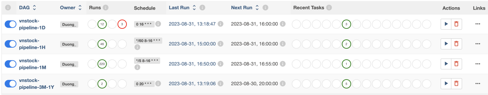
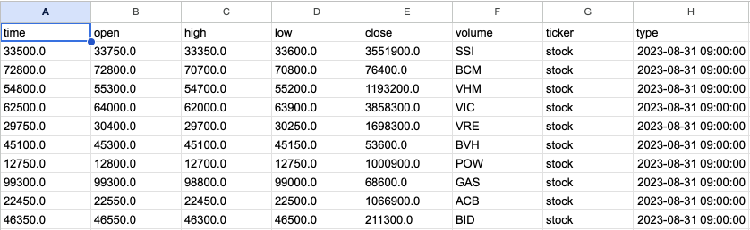

# Building a Comprehensive Data Pipeline for VN-Stock Market Analysis

This repository contains code for building a pipeline using Apache Airflow. The pipeline extracts data from vnstock (stock API of TCBS and SSI), transform it, and loads it into a datawarehouse and datamart for business analytic.

## Getting Started

Follow the steps below to setup and run this ETL pipeline.

### Prerequisites

- Apache Airflow Installation: Apache Airflow is properly installed on virtual machine.
- Email: Send error notifications for any failure in Airflow.
- Google Cloud Services Setup: Create and set up the necessary Google Cloud resources:
    - Virtual Machine (VM): 
    Provision a virtual machine instance on Google Cloud.
    - Google Cloud Storage (GCS): 
    Create the required buckets for storing your data.
    - Google BigQuery: 
    Set up and configure a BigQuery dataset to serve as your data warehouse.
    - Cloud Pubsub: 
    Record subscribed stock codes and publish them from Compute Engine.
    - Dataproc: 
    Set up Spark to read data from Cloud storage and compute data.
    - Cloud Function: 
    Trigger updates to Bigquery when new data arrives in GCS and is published on Cloud Pub/Sub.
    - Data Studio: 
    Display charts for monitoring subscribed stock codes hourly and data in 3 months for analytic.
- Telegram bot: Send message when subcribed stock codes drop 10% below expected price.

### Installation and Configuration
- Virtual Machine (VM): Ensure that you have a virtual machine instance set up with the OS Ubuntu 20.04 and environment for running Airflow tasks.
- Google Cloud Services: Install and initialize services on google cloud website.
- Telegram bot: Install and use library on `https://github.com/eternnoir/pyTelegramBotAPI`
- Airflow apache: use Local version for ubuntu.

### Process in the Pipeline

Main DAGs:
[Main.py](./src/dags/main.py)

#### Configuration

- **Owner:** Duong
- **Start Date:** August 28, 2023
- **Number of Retries:** 3 times
- **Alert of failure** Email
- **Interval between Retries:** 5 minutes

This pipeline consists of several DAGs (Direct Acyclic Graphs) that are scheduled to run at different intevals for data collection, processing, and alerting.

1. **DAG vnstock-pipeline-1D:** [collect_gcs.py](./src/pluggin/collect_gcs.py)
- Scheduler: Daily at 4 PM

- Tasks:

    1.1. __Stock_collection_1D:__ 
    Collect and process stock data for current day hourly with form:
    `['time', 'open', 'high','low', 'close','volume','ticker','type']`
    
    1.2. __Send_gsc_1D:__ 
    Send processed data to Google Cloud Storage.

    1.3. __Successful_Alert_Project_1D:__ 
    Email alert for successful pipeline execution.

2. **DAG vnstock-pipeline-3M-1Y:** 

- Scheduler: Every hour from 8 PM

- Tasks:
    
    2.1. __Stock_collection_1Y:__ [collect_gcs.py](./src/pluggin/collect_gcs.py)
    Collect and process stock data for current day hourly with form:
    `['time', 'open', 'high','low', 'close','volume','ticker','type']`
    
    
    2.2. __Send_gsc_1Y:__ [collect_gcs.py](./src/pluggin/collect_gcs.py)
    Send processed data to Google Cloud Storage.

    2.3. __Vm_pubsub_1Y:__[vm_pubsub_bq.py](./src/pluggin/vm_pubsub_bq.py)
    Publish stock index data to Cloud Pub/Sub for the lastest year.

    2.4.__Vm_pubsub_3M:__[vm_pubsub_bq.py](./src/pluggin/vm_pubsub_bq.py)
    Publish stock index data to Cloud Pub/Sub for the last 3 months.

    2.5.__Successful_Alert_Project_1Y_3M:__
    Email alert for successful pipeline execution.
    

