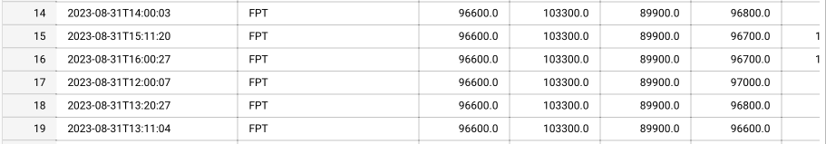
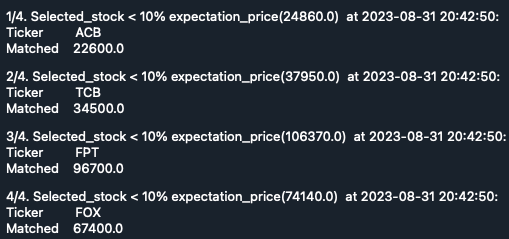

# Building a Comprehensive Data Pipeline for VN-Stock Market Analysis

This repository contains code for building a pipeline using Apache Airflow. The pipeline extracts data from vnstock (stock API of TCBS and SSI), transform it, and loads it into a datawarehouse and datamart for business analysis.

## Getting Started

Follow the steps below to setup and run this ETL pipeline.

### Prerequisites

- **Apache Airflow Installation:** Apache Airflow is properly installed on virtual machine.
- **Email:** Send error notifications for any failure in Airflow.
- **Google Cloud Services Setup:** Create and set up the necessary Google Cloud resources:
    - **Virtual Machine (VM):** Provision a virtual machine instance on Google Cloud.
    - **Google Cloud Storage (GCS):** Create the required buckets for storing your data.
    - **Google BigQuery:** Set up and configure a BigQuery dataset to serve as your data warehouse.
    - **Cloud Pubsub:** Record subscribed stock codes and publish them from Compute Engine.
    - **Dataproc:** Set up Spark to read data from Cloud storage and compute data.
    - **Cloud Function:** Trigger updates to Bigquery when new data arrives in GCS and is published on Cloud Pub/Sub.
    - **Data Studio:** Display charts for monitoring subscribed stock codes hourly and data in 3 months for analysis.
- **Telegram bot:** Send message when subcribed stock codes drop 10% below expected price.

### Installation and Configuration

- **Virtual Machine (VM):** Ensure that you have a virtual machine instance set up with the OS Ubuntu 20.04 and environment for running Airflow tasks.
- **Google Cloud Services:** Install and initialize services on google cloud website.
- **Telegram bot:** Install and use library on `https://github.com/eternnoir/pyTelegramBotAPI`
- **Airflow apache:** use Local version for ubuntu.

### Process in the Pipeline

**Main DAGs:**

[Main.py](./src/dags/main.py)

#### Configuration

- **Owner:** Duong
- **Start Date:** August 28, 2023
- **Number of Retries:** 3 times
- **Alert of failure** Email
- **Interval between Retries:** 5 minutes

This pipeline consists of several DAGs (Direct Acyclic Graphs) that are scheduled to run at different intevals for data collection, processing, and alerting.

1. **DAG vnstock-pipeline-1D:** [collect_gcs.py](./src/pluggin/collect_gcs.py)

- **Scheduler:** Daily at 4PM
- **Tasks:** Daily stock data is collected from `vnstock` and processed at hourly intervals, after which the processed data is sent to Google Cloud Storage. Furthermore, email alerts are triggered to notify successful execution of these tasks.
- **Data Format:** `['time', 'open', 'high', 'low', 'close', 'volume', 'ticker', 'type']`
**This command:** `stock_data=stock_historical_data (symbol=stock, start_date=current_date, end_date=current_date, resolution=resolution, type='stock')`
    
2. **Stock_pipeline-3M-1Y:** [collect_gcs.py](./src/pluggin/collect_gcs.py)

- **Scheduler:** Daily at 8PM

- **Task:** The system gathers a year's worth of data and stores in Google Cloud Storage. Use Spark to process data from Google Cloud Storage, then compute the most consistency growing stock codes over three-month period, where stability is defined by an average index increase within a 10% amplitude range. The results are then sent to Bigquery for advanced analysis.

- **Data Format:** `['time', 'open', 'high', 'low', 'close', 'volume', 'ticker', 'type']`
**This command:** `stock_data=stock_historical_data (symbol=stock, start_date=start_date, end_date=current_date, resolution=resolution, type='stock')` with `start_date` is one year before.

3. **vnstock-pipeline-1H:** [stock_subscription.py](./src/pluggin/stock_subscription.py)

- **Scheduler:** Between 8AM - 4PM

- **Task:** Users is possible to select their preferred stock codes for monitoring. This module continually updates the stock indices every hour during trading hours and publishes them to Cloud Pub/Sub. Upon new data being published on Cloud Pub/Sub, it triggers the system to read and incorporate the fresh information into Bigquery for seamless integration of real-time data updates.

Cloud function log: trigger from pubsub sucessfully

Bigquery received and presented data

- **Data Format:** `['Datetime', 'Ticker', 'Reference', 'Ceiling', 'Floor', 'Mached', 'Volume']`
**This command:** `sum_stock = price_depth(stock_list='ACB,TCB,FPT,FOX')`

4. **vnstock-pipeline-1M:** [stock_subscription.py](./src/pluggin/stock_subscription.py)

- **Scheduler:** Between 8AM - 4PM with every 5 minutes

- **Task:** Send Telegram notifications whenever a subscribed stock code experiences a 10% decrease in value compared to your expected price.

- **Data Format:** `['Datetime', 'Ticker', 'Reference', 'Ceiling', 'Floor', 'Mached', 'Volume']`
**This command:** `sum_stock = price_depth(stock_list='ACB,TCB,FPT,FOX')`

5. **Visualization:**

- **Scheduler:** Hourly 

- **Task:** In Data Studio, set up line charts that display real-time hourly updates for the stock codes you've subscribed to. Additionally, create line charts that visualize the stable-growing stock codes over a three-month period for insightful analysis.

