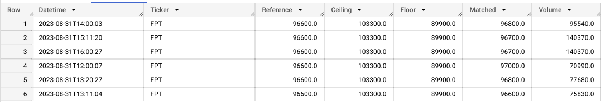
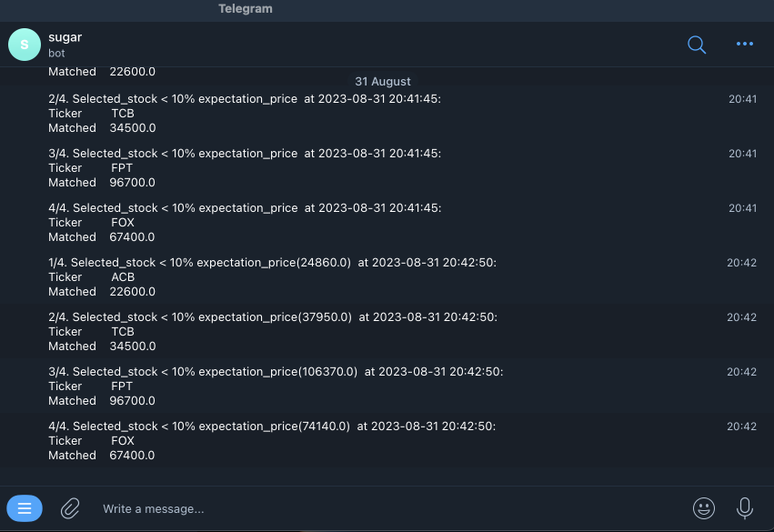

# Building a Comprehensive Data Pipeline for VN-Stock Market Analysis

This project contains process for building a pipeline using `Apache Airflow`. The pipeline extracts data from `vnstock` (stock API of TCBS and SSI), transform it, and loads it into a `data warehouse` and `datamart` for business analysis.

## Getting Started

Follow the steps below to setup and run this ETL pipeline.

### Prerequisites and Installation

Before setting up and running this `ETL pipeline`, please ensure you have the following prerequisites in place:

1. **Apache Airflow Installation:** Make sure you have `Apache Airflow` correctly installed on your virtual machine. Refer to the [Airflow apache setup](https://github.com/apache/airflow).

2. **Email:** Configure your email settings to receive error notifications in case of any pipeline failures. Refer to the [Sending Emails using Airflow EmailOperator](https://hevodata.com/learn/airflow-emailoperator/)

3. **Google Cloud Services Setup:** Create and configure the necessary `Google Cloud Service` resources as following:

    - **Virtual Machine (VM):** Provision a `virtual machine` instance on `Google Cloud Serice` to serve as your data processing environment. Refer to the [Virtual machine instances guide](https://cloud.google.com/compute/docs/instances)

    - **Google Cloud Storage (GCS):** Set up `Google Cloud Storage` and create the required `buckets` to store your data. Refer to the [Cloud Storage documentation](https://cloud.google.com/storage/docs)

    - **Google BigQuery:** Create and configure a `BigQuery dataset` that will serve as your `data warehouse`. Refer to the [BigQuery documentation](https://cloud.google.com/bigquery/docs)

    - **Cloud Pubsub:** Set up `Cloud Pub/Sub` to record subscribed stock codes and publish them from the Compute Engine. Refer to the [Cloud Pub/Sub documentation](https://cloud.google.com/pubsub/docs)

    - **Cloud Function:** Create `Cloud Functions` to trigger updates to `BigQuery Table` when new data arrives in `Google Cloud Storage` and is published on `Cloud Pub/Sub`. Refer to the [Cloud Functions documentation](https://cloud.google.com/functions/docs).

    - **Data Studio:** Prepare `Data Studio` for displaying charts to monitor subscribed stock codes hourly and data for the last 3 months for analysis. Refer to the [Looker Studio](https://developers.google.com/looker-studio).

4. **Telegram Bot:** To receive `Telegram` notifications when subscribed stock codes drop by 10% below the expected price, you'll need to install and use the [pyTelegramBotAPI library](https://github.com/eternnoir/pyTelegramBotAPI).

5. **Dataproc:** Configure `Dataproc` and set up `Spark` to read data from `Cloud Storage` and perform data processing tasks. Refer to the [Dataproc documentation](https://spark.apache.org/docs/latest/sql-getting-started.html)

These prerequisites are essential for setting up and running the VN-Stock Market Analysis data pipeline. Once you have these in place, you can proceed with the installation and configuration steps below.

### Process in the Pipeline

**Main DAGs:**

[Main.py](./src/dags/main.py)

#### Configuration

- **Owner:** Duong.
- **Start Date:** August 28, 2023.
- **Number of Retries:** 3 times.
- **Alert of failure:** Email.
- **Interval between Retries:** 5 minutes.

This pipeline consists of several `DAGs` (Direct Acyclic Graphs) that are scheduled to run at different intevals for data collection, processing, and alerting.

1. **DAG vnstock-pipeline-1D:** [collect_gcs.py](./src/pluggin/collect_gcs.py)

- **Scheduler:** Daily at 4PM.

- **Tasks:** Daily stock data is collected from `vnstock` and processed at hourly intervals, after which the processed data is sent to `Google Cloud Storage`. Furthermore, `email alerts` are triggered to notify successful execution of these tasks.

- **Data Format:** `['time', 'open', 'high', 'low', 'close', 'volume', 'ticker', 'type']`.

**This command:** `stock_data=stock_historical_data (symbol=stock, start_date=current_date, end_date=current_date, resolution=resolution, type='stock')`
    
2. **Stock_pipeline-3M-1Y:** [collect_gcs.py](./src/pluggin/collect_gcs.py)

- **Scheduler:** Daily at 8PM.

- **Task:** The system gathers a year's worth of data and stores in `Google Cloud Storage`. Use Spark to process data from `Google Cloud Storage`, then compute the most consistency growing stock codes over three-month period, where stability is defined by an average index increase within a 10% amplitude range. The results are then sent to `Bigquery` for advanced analysis.

- **Data Format:** `['time', 'open', 'high', 'low', 'close', 'volume', 'ticker', 'type']`.

**This command:** `stock_data=stock_historical_data (symbol=stock, start_date=start_date, end_date=current_date, resolution=resolution, type='stock')` with `start_date` is one year before.

3. **vnstock-pipeline-1H:** [stock_subscription.py](./src/pluggin/stock_subscription.py)

- **Scheduler:** Between 8AM - 4PM.

- **Task:** Users is possible to select their preferred stock codes for monitoring. This module continually updates the stock indices every hour during trading hours and publishes them to `Cloud Pub/Sub`. Upon new data being published on `Cloud Pub/Sub`, it triggers the system to read and incorporate the fresh information into `Bigquery` for seamless integration of real-time data updates.

**Cloud function log:** check and trigger when `Cloud pubsub` received sucessfully data from vm.

**Bigquery:** received and presented data.

- **Data Format:** `['Datetime', 'Ticker', 'Reference', 'Ceiling', 'Floor', 'Mached', 'Volume']`.

**This command:** `sum_stock = price_depth(stock_list='ACB,TCB,FPT,FOX')`.

4. **vnstock-pipeline-1M:** [stock_subscription.py](./src/pluggin/stock_subscription.py)

- **Scheduler:** Between 8AM - 4PM with every 5 minutes.

- **Task:** Send Telegram notifications whenever a subscribed stock code experiences a 10% decrease in value compared to your expected price.

- **Data Format:** `['Datetime', 'Ticker', 'Reference', 'Ceiling', 'Floor', 'Mached', 'Volume']`.

**This command:** `sum_stock = price_depth(stock_list='ACB,TCB,FPT,FOX')`.

5. **Visualization:**

- **Scheduler:** Hourly.

- **Task:** In Data Studio, set up line charts that display real-time hourly updates for the stock codes you've subscribed to. Additionally, create line charts that visualize the stable-growing stock codes over a three-month period for insightful analysis.

# THE END #

